<div align="center">

#  CatchMe

### Real-Time 360° Tactical Bluetooth & BLE Radar for Android

**Transforming commercial smartphones into directional RF presence detectors using Sensor Fusion & Pedestrian Dead Reckoning.**

<br/>

[](https://kotlinlang.org/)
[](https://developer.android.com/jetpack/compose)
[](https://developer.android.com/)

<br/>

[](https://github.com/RASH-2137/Catchme/releases)
[]()

<br/>

</div>

<br/>

<p align="center">
  <a href="#-features"><strong>✨ Features</strong></a> •
  <a href="#-system-architecture"><strong>🏗️ Architecture</strong></a> •
  <a href="#-signal-physics--pdr-math"><strong>📐 Mathematics</strong></a> •
  <a href="#-search--rescue-sar-potential"><strong>🚨 SAR Utility</strong></a> •
  <a href="#-screenshots--showcase"><strong>📸 Showcase</strong></a> •
  <a href="#-getting-started"><strong>🚀 Getting Started</strong></a>
</p>

---

## 📖 Overview

**CatchMe** is a real-time, hardware-accelerated Android tactical radar application built using **Kotlin** and **Jetpack Compose**. 

Standard smartphone operating systems only expose nearby Bluetooth devices as disconnected, alphabetical lists without spatial context. **CatchMe bridges the gap between raw RF telemetry and physical space** — fusing dual-mode Bluetooth sniffing (BLE + Classic BR/EDR) with on-device inertial sensors and **Pedestrian Dead Reckoning (PDR)** to render an interactive, 360° heading-up tactical radar.

As the operator turns their body, the tactical display smoothly rotates in real-time (Google Maps navigation-style), allowing immediate orientation toward nearby active RF transmitters (smartphones, fitness bands, smartwatches, earbuds, beacons).

> [!TIP]
> Built from the ground up to operate completely offline without internet, cell towers, or external infrastructure.

---

## 🚨 Search & Rescue (SAR) Potential

While initially engineered as a tactical proximity locator, CatchMe explores practical applications in **emergency response and post-disaster Search & Rescue (SAR)**:

* **GPS-Denied Structural Searches**: In collapsed buildings, basements, tunnels, or dense concrete interiors, satellite GPS is inaccessible. CatchMe functions autonomously using purely local RF sniffing and inertial sensor dead reckoning.
* **Passive Victim Triangulation**: Survivors trapped beneath drywall, rubble, or within adjacent rooms frequently carry active Bluetooth emitters (smartphones, fitness bands, smartwatches).
* **Through-Wall RF Penetration**: 2.4 GHz ISM band signals penetrate drywall, wooden partitions, and hollow obstacles. By calibrating for indoor wall attenuation, emergency personnel can sweep corridors to verify human presence before structural breaches.
* **Ad-Hoc Personnel Tracking**: Operates as a lightweight situational awareness display for tactical teams operating in localized clusters without external relays.

---

## ⭐ Highlights

- 🧭 **Heading-Up Spatial Transform**: Continuous 360° rotation locked to device azimuth quaternions.
- 📡 **Dual-Mode RF Sniffing**: Unified listener intercepting BLE advertisements (`ScanResult`) and Classic Bluetooth inquiries (`ACTION_FOUND`).
- 🚶 **Pedestrian Dead Reckoning (PDR)**: Step impulse detection fused with trigonometric coordinate projection.
- 📐 **Log-Distance Path Loss Model**: Dynamic RSSI distance conversion with wall attenuation filtering.
- 🎨 **Tactical Jetpack Compose Canvas**: Hardware-accelerated sweep beam, range rings, and dynamic color-coded blip tracking.
- ⚡ **Asynchronous Thread Bridge**: Background radio callbacks safely marshalled to main Compose recomposition states via Looper handlers.
- ⏱️ **Auto-Decay Garbage Collection**: Silent or departed emitters are automatically purged after a 25-second inactivity timeout.

---

## 📑 Table of Contents

- [Overview](#-overview)
- [Search & Rescue (SAR) Potential](#-search--rescue-sar-potential)
- [Features](#-features)
- [System Architecture](#-system-architecture)
- [Signal Physics & PDR Math](#-signal-physics--pdr-math)
- [Screenshots & Showcase](#-screenshots--showcase)
- [Tech Stack](#-tech-stack)
- [Repository Structure](#-repository-structure)
- [Getting Started](#-getting-started)

---

## ✨ Features

<table>
<tr>
<td width="50%" valign="top">

### 🎯 360° Heading-Up Radar
The visual world rotates smoothly around your avatar. Wherever the phone points is physically rendered as **UP**, allowing intuitive directional navigation toward targets.

### 📡 Dual-Protocol Interceptor
Captures both modern Bluetooth Low Energy advertising bursts (smartwatches, IoT tags) and legacy Classic Bluetooth inquiry responses (smartphones, speakers, smart TVs).

### 🏷️ Intelligent Manufacturer Parsing
Automatically categorizes and formats raw Bluetooth MAC addresses into clean hardware classifications (`Phone`, `Smartwatch`, `boAt Audio`, `Apple`, `Samsung`).

</td>
<td width="50%" valign="top">

### 🚶 Inertial Step Tracking
Uses hardware `TYPE_STEP_DETECTOR` and orientation sensors to calculate total steps, displacement distance, and directional user path.

### 🔍 Target Inspector Drawer
An expandable tactical drawer displaying detailed telemetry for every target: RSSI in dBm, peak acquisition angle, and dual distance models (Open Air vs. Wall).

### 🛡️ Android 13/14+ Security Ready
Fully compliant with modern Android security models: runtime permission flows, `RECEIVER_EXPORTED` broadcast flags, and safe name extraction.

</td>
</tr>
</table>

---

## 🏗️ System Architecture

CatchMe follows a clean, reactive architecture with strict separation between low-level hardware callbacks, math engines, and the Compose UI layer:

```mermaid
flowchart TD
    subgraph RF_Subsystem [RF Scanning Engine]
        A[BLE Advertisement Scanner]
        B[Classic BT Discovery Receiver]
    end

    subgraph Motion_Subsystem [Inertial Motion Engine]
        C[Step Detector Sensor]
        D[Rotation Vector Sensor]
    end

    subgraph Processing_Layer [Core Radar Engines]
        E[BleScanner Controller]
        F[StepTracker PDR Engine]
        G[RadarEngine Math Core]
    end

    subgraph Presentation_Layer [Tactical UI]
        H[MainActivity State Coordinator]
        I[RadarScreen Compose Canvas]
        J[Expandable Target Drawer]
    end

    A -->|ScanResult Packets| E
    B -->|ACTION_FOUND Broadcasts| E
    C -->|Step Impulses| F
    D -->|Quaternions / Heading| F

    E -->|BleSignal DTO| G
    F -->|Position & Heading| G

    G -->|RadarBlip Target Model| H
    F -->|Telemetry State| H

    H -->|Main Thread Dispatch| I
    H -->|Observable State| J

    classDef hardware fill:#0b192c,stroke:#00e5ff,stroke-width:2px;
    classDef engine fill:#0f2027,stroke:#00ff66,stroke-width:2px;
    classDef ui fill:#1b1b2f,stroke:#ff007f,stroke-width:2px;

    class A,B,C,D hardware;
    class E,F,G engine;
    class H,I,J ui;
```



---

## 📐 Signal Physics & PDR Math

### 1. Distance Approximation (Log-Distance Path Loss)
Radio frequency signal strength drops logarithmically over physical distance. CatchMe computes distance $d$ using the inverse path loss formula:

$$d = 10^{\frac{P_{\text{tx}} - \text{RSSI}}{10 \cdot n}}$$

Where:
- $P_{\text{tx}}$: Calibrated RSSI at 1 meter reference distance (default: $-59\text{ dBm}$)
- $\text{RSSI}$: Received Signal Strength Indicator in $\text{dBm}$
- $n$: Path loss exponent:
  - **Open Air Free-Space**: $n = 2.0$
  - **Obstructed Wall Model**: $n = 2.8$ with a $+10\text{ dB}$ attenuation penalty applied to simulate drywall absorption.

### 2. Relative Angular Projection
To render targets relative to the device's physical orientation, the relative bearing $\theta_{\text{rel}}$ is computed using the target's peak acquisition angle $\theta_{\text{peak}}$ and the current heading $\theta_{\text{user}}$:

$$\theta_{\text{rel}} = (\theta_{\text{peak}} - \theta_{\text{user}} + 360^\circ) \pmod{360^\circ}$$

Polar coordinates $(\theta_{\text{rel}}, d)$ are converted directly into 2D screen coordinates $(X_{\text{target}}, Y_{\text{target}})$ on the Compose canvas:

$$X_{\text{target}} = X_{\text{center}} + \left(\sin(\theta_{\text{rel}}) \cdot r_{\text{scaled}}\right)$$

$$Y_{\text{target}} = Y_{\text{center}} - \left(\cos(\theta_{\text{rel}}) \cdot r_{\text{scaled}}\right)$$

### 3. Pedestrian Dead Reckoning (PDR)
Displacement updates occur on each detected physical footstep using user heading $\theta$:

$$\Delta X = \text{strideLength} \cdot \sin(\theta)$$

$$\Delta Y = \text{strideLength} \cdot \cos(\theta)$$

---

## 📸 Screenshots & Showcase

<div align="center">

### Tactical Radar in Action

<!-- Place demo video / GIF here -->
<!--  -->

<br/>

| 360° Tactical Radar Screen | Target Inspector Drawer
|:---:|:---:|
|  | 
| Live Device Tracking |
 | <video src="https://private-user-images.githubusercontent.com/178595938/665061191-08778a26-2d8f-42c7-a1bc-3ff180c67003.mp4?jwt=eyJ0eXAiOiJKV1QiLCJhbGciOiJIUzI1NiJ9.eyJpc3MiOiJnaXRodWIuY29tIiwiYXVkIjoicmF3LmdpdGh1YnVzZXJjb250ZW50LmNvbSIsImtleSI6ImtleTUiLCJleHAiOjE3OTExMDM0MTQsIm5iZiI6MTc5MTEwMzExNCwicGF0aCI6Ii8xNzg1OTU5MzgvNjY1MDYxMTkxLTA4Nzc4YTI2LTJkOGYtNDJjNy1hMWJjLTNmZjE4MGM2NzAwMy5tcDQ_WC1BbXotQWxnb3JpdGhtPUFXUzQtSE1BQy1TSEEyNTYmWC1BbXotQ3JlZGVudGlhbD1BS0lBVkNPRFlMU0E1M1BRSzRaQSUyRjIwMjYxMDA0JTJGdXMtZWFzdC0xJTJGczMlMkZhd3M0X3JlcXVlc3QmWC1BbXotRGF0ZT0yMDI2MTAwNFQwODM4MzRaJlgtQW16LUV4cGlyZXM9MzAwJlgtQW16LVNpZ25hdHVyZT05YjAyYzdiNTJlYWVjMDViMWFmODc5N2U3YjRiZTAzNjhjNTcxYmE5ODAyMTEzYmExNTRhZDE0YjAzMWNhZDU5JlgtQW16LVNpZ25lZEhlYWRlcnM9aG9zdCZyZXNwb25zZS1jb250ZW50LXR5cGU9dmlkZW8lMkZtcDQifQ.FBrXBEQnC-ks8FFG5Vo8lGI4Q02ilgUrjoX_vGNxLAo" width="212" controls></video> | |

</div>

---

## 🛠️ Tech Stack

| Layer | Technology | Purpose |
|:---|:---|:---|
| **Language** | Kotlin 2.0+ | Modern Android development language |
| **UI Framework** | Jetpack Compose | Declarative UI & custom hardware Canvas rendering |
| **Design System** | Material 3 | Dark tactical HUD aesthetics |
| **RF Sniffing** | Android Bluetooth APIs | Dual-mode BLE (`BluetoothLeScanner`) & Classic BT (`ACTION_FOUND`) |
| **Motion Sensors** | Android Sensor Framework | Hardware Step Detector & Rotation Vector sensor fusion |
| **Architecture** | Unidirectional Data Flow | Thread-safe async handler state dispatching |
| **Build System** | Gradle Kotlin DSL (`build.gradle.kts`) | Dependency and build automation |

---

## 📂 Repository Structure

```text
Catchme/
│
├── app/
│   ├── src/main/
│   │   ├── java/com/example/catchme/
│   │   │   ├── BleScanner.kt       # Dual-mode BLE & Classic RF interceptor
│   │   │   ├── StepTracker.kt      # PDR step detection & orientation fusion
│   │   │   ├── RadarEngine.kt      # Path loss math, peak angle & target cache
│   │   │   ├── RadarScreen.kt      # Hardware Compose canvas, sweep & HUD
│   │   │   └── MainActivity.kt     # App entry, permissions & thread bridge
│   │   │
│   │   ├── res/                    # Drawables, launcher icons, themes
│   │   └── AndroidManifest.xml     # Hardware feature flags & permissions
│   │
│   ├── build.gradle.kts            # App-level build configuration
│   └── proguard-rules.pro          # Release minification rules
│
├── gradle/                         # Gradle wrapper files
├── .gitignore                      # Git ignore with keystore protections
├── README.md                       # Documentation
└── settings.gradle.kts             # Module definitions
```

---

## 🚀 Getting Started

### Prerequisites
- Android Studio Ladybug or newer
- Physical Android device with Android 8.0 (API 26) or higher
- Device equipped with Bluetooth & Hardware Compass/Rotation sensors

### Installation
1. Clone the repository:
   ```bash
   git clone https://github.com/RASH-2137/Catchme.git
   cd Catchme
   ```
2. Open the project folder in Android Studio.
3. Allow Gradle to sync all dependencies.
4. Connect your Android device via USB with **USB Debugging** enabled.
5. Click **Run ('app')** (`Shift + F10`).

---

<div align="center">

**👨‍💻 Rahul Sharma**

Portfolio: [spacekid.xyz](https://spacekid.xyz) • GitHub: [@RASH-2137](https://github.com/RASH-2137)

[Report Bug](../../issues) · [Request Feature](../../issues)

</div>
